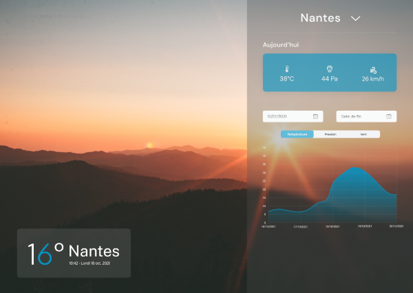

# Projet Aéroport ✈️

Système de collecte et de restitution de données météo des aéroports (température, vitesse du vent, pression atmosphérique)

Projet réalisé dans le cadre du module "Infrastructures d'intégration" de l'IMT Atlantique.

Créé par Théo LETOUZÉ, Clément NICOLAS, Loïs GIGAUD, Julien RAQUOIS



## Contenu 📋

- 3 publishers en Go envoyant les données des capteurs
- Un broker MQTT Mosquitto réalisant la liaison entre les publishers et la base de données et le fichier csv
- Une base de données MongoDB
- Une API REST en Go
- Un client REST en VueJS (v3)

## Architecture 


## Installation avec Docker (recommandée) 🐳

1. Installer docker sur votre machine 
2. Lancer le projet avec la commande :
```shell
docker-compose up -d
```
3. Les différents parties du projet sont disponibles aux adresses suivantes : 
  - MongoDB : [localhost:27017](localhost:27017)
  - Mosquitto : [localhost:52883](localhost:52883)
  - API : [localhost:3333](localhost:3333)
  - Client : [localhost:3000](localhost:3000)

## Installation sans Docker :warning:

1. Installer MongoDB sur votre machine
2. Installer Mosquitto sur votre machine
3. Modifier la configuration des publishers et subscribers si les ports de MongoDB et Mosquitto sont différents (optionnel)
4. Compiler le code des publishers et subscribers (optionnel)
```shell
# Depuis le dossier broker
go build
```
5. Lancer les publishers et subscribers
```shell
# Depuis le dossier broker
./docker.sh
```
6. Modifier la configuration de l'API si le port de MongoDB est différent (optionnel)
7. Lancer l'API
```shell
# Depuis le dossier api
go run main.go
```
8. Installer les dépendances du client
```shell
# Depuis le dossier client
npm install
```
9. Lancer le client
```shell
# Depuis le dossier client
npm run dev
```
10. Les différents parties du projet sont disponibles aux adresses suivantes : 
  - API : [localhost:3333](localhost:3333)
  - Client : [localhost:3000](localhost:3000)


## Plus de documentation :book:

[Documentation complète des publishers et subscribers](broker/README.md)

[Documentation complète de l'API](api/README.md)

[Documentation complète du client](client/README.md)


